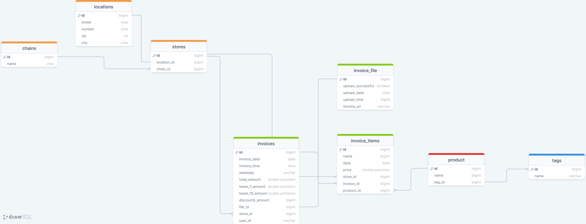
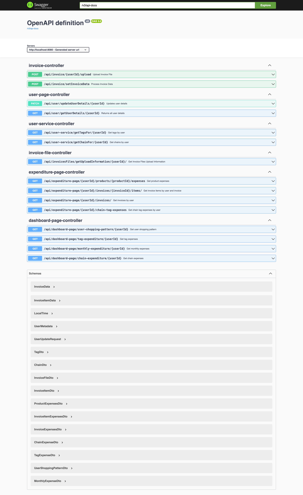
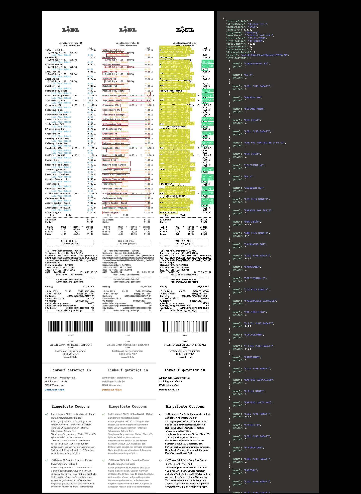

# Introduction
Our goal was to create a user-friendly app that uses AI to sort and display receipts from food shops.

This project was a [university software project](https://www.hdm-stuttgart.de/medianight/projekte?projekt_ID=4297) from October 2023 to January 2024. The project was rated 1.0. The project was rated 1.0, meaning it met all requirements.

My task was to:

* Plan and build the backend logic with Java
* Plan and build the database with PostgreSQL
* Dockerise the frontend, backend, database and write a Docker-compose.yml for all services
* Integrate the login service from Auth0 by Okta.


## Impression

### Planning database
Graphical planning of the database 


<br>
### Swagger UI
Swagger was used

<br>
### AI Demo
How the AI worked


Our project aims to assist users in visualising and monitoring their grocery spending in a simple and enjoyable manner. By scanning receipts, our AI components and graphics enable users to track their spending, monitor price changes, and shopping behaviour.

This helps users to gain a better understanding of inflation in Germany. Uploading receipts is a breeze, and with minimal data, users can obtain a comprehensive overview of their shopping behaviour. For instance, individuals can monitor the price changes of different products, such as bananas, over time and determine the most affordable place to make a purchase.

# run project
So that the project can be executed locally:

- the respective .env file must be stored in the backend folder
- the respective .env file must be stored in the ai-logic-et folder
- the respective auth_config.json must be stored in the frontend-et folder.

To start the Docker image, run the following command in the root directory of the project:
```bash
docker-compose up -d
```